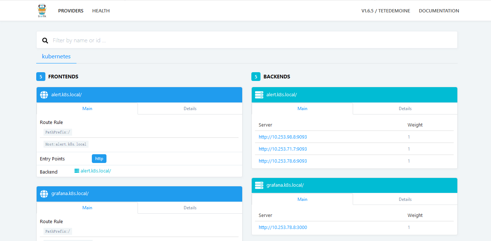
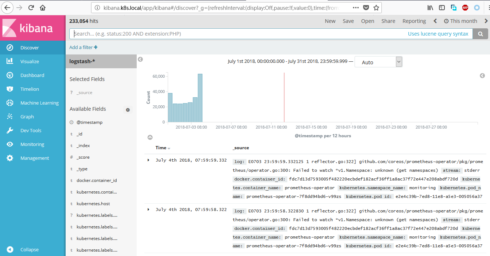

# 部署EFK

## 参考链接

[Elasticsearch Add-On](https://github.com/kubernetes/kubernetes/tree/master/cluster/addons/fluentd-elasticsearch)

## 标记节点

```bash
[root@vm01 ~]# for x in vm0{1,2,3,4};do kubectl label nodes $x beta.kubernetes.io/fluentd-ds-ready=true;done
node "vm01" labeled
node "vm02" labeled
node "vm03" labeled
node "vm04" labeled

[root@vm01 ~]# kubectl get node  --show-labels
NAME      STATUS    ROLES     AGE       VERSION   LABELS
vm01      Ready     master    3d        v1.10.4   beta.kubernetes.io/arch=amd64,beta.kubernetes.io/fluentd-ds-ready=true,beta.kubernetes.io/os=linux,kubernetes.io/hostname=vm01,node-role.kubernetes.io/master=true
vm02      Ready     master    3d        v1.10.4   beta.kubernetes.io/arch=amd64,beta.kubernetes.io/fluentd-ds-ready=true,beta.kubernetes.io/os=linux,kubernetes.io/hostname=vm02,node-role.kubernetes.io/master=true
vm03      Ready     node      3d        v1.10.4   beta.kubernetes.io/arch=amd64,beta.kubernetes.io/fluentd-ds-ready=true,beta.kubernetes.io/os=linux,kubernetes.io/hostname=vm03,node-role.kubernetes.io/node=true
vm04      Ready     node      3d        v1.10.4   beta.kubernetes.io/arch=amd64,beta.kubernetes.io/fluentd-ds-ready=true,beta.kubernetes.io/os=linux,kubernetes.io/hostname=vm04,node-role.kubernetes.io/node=true
```

## 安装efk

```bash
[root@vm01 ~]# wget https://raw.githubusercontent.com/kubernetes/kubernetes/master/cluster/addons/fluentd-elasticsearch/es-statefulset.yaml
[root@vm01 ~]# wget https://raw.githubusercontent.com/kubernetes/kubernetes/master/cluster/addons/fluentd-elasticsearch/es-service.yaml
[root@vm01 ~]# wget https://raw.githubusercontent.com/kubernetes/kubernetes/master/cluster/addons/fluentd-elasticsearch/fluentd-es-configmap.yaml
[root@vm01 ~]# wget https://raw.githubusercontent.com/kubernetes/kubernetes/master/cluster/addons/fluentd-elasticsearch/fluentd-es-ds.yaml
[root@vm01 ~]# wget https://raw.githubusercontent.com/kubernetes/kubernetes/master/cluster/addons/fluentd-elasticsearch/kibana-deployment.yaml
[root@vm01 ~]# wget https://raw.githubusercontent.com/kubernetes/kubernetes/master/cluster/addons/fluentd-elasticsearch/kibana-service.yaml
```

```bash
[root@vm01 ~]# vi kibana-deployment.yaml
#          - name: SERVER_BASEPATH
#            value: /api/v1/namespaces/kube-system/services/kibana-logging/proxy
```

* 注释这两行，不用apiserver proxy方式访问kibana，后续通过ingress访问；

```bash
[root@vm01 ~]# ls *.yaml
es-service.yaml  es-statefulset.yaml  fluentd-es-configmap.yaml  fluentd-es-ds.yaml  kibana-deployment.yaml  kibana-service.yaml

[root@vm01 ~]# for x in *.yaml ;do kubectl create -f $x;done
service "elasticsearch-logging" created
serviceaccount "elasticsearch-logging" created
clusterrole.rbac.authorization.k8s.io "elasticsearch-logging" created
clusterrolebinding.rbac.authorization.k8s.io "elasticsearch-logging" created
statefulset.apps "elasticsearch-logging" created
configmap "fluentd-es-config-v0.1.4" created
serviceaccount "fluentd-es" created
clusterrole.rbac.authorization.k8s.io "fluentd-es" created
clusterrolebinding.rbac.authorization.k8s.io "fluentd-es" created
daemonset.apps "fluentd-es-v2.0.4" created
deployment.apps "kibana-logging" created
service "kibana-logging" created
```

## 创建ingress规则

```bash
[root@vm01 ~]# htpasswd -c ./auth admin
New password:
Re-type new password:
Adding password for user admin

[root@vm01 ~]# cat auth
admin:$apr1$6lh1/vo/$IToBtwRLm4I5xPIvl0nd3/
[root@vm01 ~]# kubectl create secret generic traefik-admin --from-file auth --namespace=kube-system
secret "traefik-admin" created
```

* 为ingress创建http验证；

```bash
[root@vm01 ~]# vi ingress.yaml
apiVersion: extensions/v1beta1
kind: Ingress
metadata:
  name: k8s-ingress
  namespace: kube-system
  annotations:
    kubernetes.io/ingress.class: traefik
    ingress.kubernetes.io/auth-type: "basic"
    ingress.kubernetes.io/auth-secret: "traefik-admin"
spec:
  rules:
  - host: traefik-ui.k8s.local
    http:
      paths:
      - path: /
        backend:
          serviceName: traefik-ingress-service
          servicePort: 8080
  - host: kibana.k8s.local
    http:
      paths:
      - path: /
        backend:
          serviceName: kibana-logging
          servicePort: 5601

[root@vm01 ~]# kubectl create -f ingress.yaml
ingress.extensions "k8s-ingress" created
```

* 为traefik的webui和kibana创建ingress规则；

## 配置客户端

```bash
172.16.16.81    traefik-ui.k8s.local
172.16.16.81    kibana.k8s.local
```

* 修改访问客户端的hosts文件，增加两条静态解析，即可通过域名访问traefik webui和kibana；

## 访问traefik ingress和kibana

浏览器输入`traefik-ui.k8s.local`访问traefik ingress webui：



浏览器输入`kibana.k8s.local`访问kibana webui：



## 为elasticsearch创建存储

```bash
[root@vm01 ~]# kubectl delete -f es-statefulset.yaml
[root@vm01 ~]# vi es-statefulset.yaml

# RBAC authn and authz
apiVersion: v1
kind: ServiceAccount
metadata:
  name: elasticsearch-logging
  namespace: kube-system
  labels:
    k8s-app: elasticsearch-logging
    kubernetes.io/cluster-service: "true"
    addonmanager.kubernetes.io/mode: Reconcile
---
kind: ClusterRole
apiVersion: rbac.authorization.k8s.io/v1
metadata:
  name: elasticsearch-logging
  labels:
    k8s-app: elasticsearch-logging
    kubernetes.io/cluster-service: "true"
    addonmanager.kubernetes.io/mode: Reconcile
rules:
- apiGroups:
  - ""
  resources:
  - "services"
  - "namespaces"
  - "endpoints"
  verbs:
  - "get"
---
kind: ClusterRoleBinding
apiVersion: rbac.authorization.k8s.io/v1
metadata:
  namespace: kube-system
  name: elasticsearch-logging
  labels:
    k8s-app: elasticsearch-logging
    kubernetes.io/cluster-service: "true"
    addonmanager.kubernetes.io/mode: Reconcile
subjects:
- kind: ServiceAccount
  name: elasticsearch-logging
  namespace: kube-system
  apiGroup: ""
roleRef:
  kind: ClusterRole
  name: elasticsearch-logging
  apiGroup: ""
---
# Elasticsearch deployment itself
apiVersion: apps/v1
kind: StatefulSet
metadata:
  name: elasticsearch-logging
  namespace: kube-system
  labels:
    k8s-app: elasticsearch-logging
    version: v5.6.4
    kubernetes.io/cluster-service: "true"
    addonmanager.kubernetes.io/mode: Reconcile
spec:
  serviceName: elasticsearch-logging
  replicas: 2
  selector:
    matchLabels:
      k8s-app: elasticsearch-logging
      version: v5.6.4
  template:
    metadata:
      labels:
        k8s-app: elasticsearch-logging
        version: v5.6.4
        kubernetes.io/cluster-service: "true"
    spec:
      serviceAccountName: elasticsearch-logging
      containers:
      - image: k8s.gcr.io/elasticsearch:v5.6.4
        name: elasticsearch-logging
        resources:
          # need more cpu upon initialization, therefore burstable class
          limits:
            cpu: 1000m
          requests:
            cpu: 100m
        ports:
        - containerPort: 9200
          name: db
          protocol: TCP
        - containerPort: 9300
          name: transport
          protocol: TCP
        volumeMounts:
        - name: data
          mountPath: /data
        env:
        - name: "NAMESPACE"
          valueFrom:
            fieldRef:
              fieldPath: metadata.namespace
      # Elasticsearch requires vm.max_map_count to be at least 262144.
      # If your OS already sets up this number to a higher value, feel free
      # to remove this init container.
      initContainers:
      - image: alpine:3.6
        command: ["/sbin/sysctl", "-w", "vm.max_map_count=262144"]
        name: elasticsearch-logging-init
        securityContext:
          privileged: true
  volumeClaimTemplates:
  - metadata:
      name: data
    spec:
      accessModes: [ "ReadWriteOnce" ]
      storageClassName: "glusterfs"
      resources:
        requests:
          storage: 5G

[root@vm01 ~]# kubectl create -f es-statefulset.yaml
```