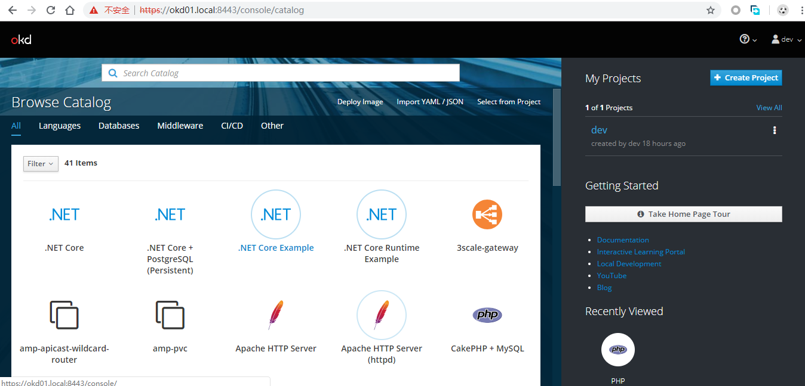

# openshift 3.10 部署

openshift是redhat公司开源的基于kubernetes的容器云平台。本文主要介绍在CentOS-7.5-1804上如何部署一个简单的集群。

## 系统环境

* 4台4CPU、16G内存虚拟机；
* 系统CentOS-7.5-1804-x64；
* ip地址172.16.16.81-84；

## 环境准备

```bash
# yum -y install centos-release-openshift-origin310 epel-release docker git pyOpenSSL
# systemctl start docker && systemctl enable docker
```

* 所有节点安装epel、openshift-origin的yum源等软件包；

```bash
# vi /etc/hosts
172.16.16.81    okd01.local
172.16.16.82    okd02.local
172.16.16.83    okd03.local
172.16.16.84    okd04.local
```

* 在所有节点上配置hosts;

```bash
[root@okd01 ~]# ssh-keygen -q -N ""
[root@okd01 ~]# ssh-copy-id okd01.local
[root@okd01 ~]# ssh-copy-id okd02.local
[root@okd01 ~]# ssh-copy-id okd03.local
[root@okd01 ~]# ssh-copy-id okd04.local
```

* 在okd01上配置ssh密钥登录；

```bash
[root@okd01 ~]# yum -y install openshift-ansible
```

## 安装openshift

* okd01节点上安装openshift-ansible的playbook；

```bash
[root@okd01 ~]# vi /etc/ansible/hosts
[OSEv3:children]
masters
nodes
etcd

[OSEv3:vars]
ansible_ssh_user=root
openshift_deployment_type=origin
openshift_master_identity_providers=[{'name': 'htpasswd_auth', 'login': 'true', 'challenge': 'true', 'kind': 'HTPasswdPasswordIdentityProvider'}]
openshift_master_default_subdomain=okd.local
os_firewall_use_firewalld=true
os_sdn_network_plugin_name=redhat/openshift-ovs-multitenant
osm_cluster_network_cidr=10.253.0.0/16
openshift_portal_net=10.254.0.0/16
openshift_disable_check=disk_availability,docker_storage,memory_availability,docker_image_availability

[masters]
okd01.local openshift_schedulable=true containerized=false

[etcd]
okd01.local

[nodes]
okd01.local openshift_node_group_name='node-config-master-infra'
okd02.local openshift_node_group_name='node-config-compute'
okd03.local openshift_node_group_name='node-config-compute'
okd04.local openshift_node_group_name='node-config-compute'
```

* 指定ansible用root登录其他机器；
* openshift_deployment_type指定安装版本为origin开源版；
* openshift_master_identity_providers配置身份认证提供者；
* openshift_master_default_subdomain配置master服务的默认域；
* os_firewall_use_firewalld配置openshift使用firewalld管理策略，而不是iptables；
* os_sdn_network_plugin_name采用多租户网络redhat/openshift-ovs-multitenant；
* osm_cluster_network_cidr对应k8s的pod ip地址；
* openshift_portal_net对应k8s的service ip地址；
* openshift_disable_check禁用磁盘空间、内存、docker镜像的测试；
* openshift_node_group_name指定节点的角色；

```bash
[root@okd01 ~]# ansible-playbook /usr/share/ansible/openshift-ansible/playbooks/prerequisites.yml
[root@okd01 ~]# ansible-playbook /usr/share/ansible/openshift-ansible/playbooks/deploy_cluster.yml
```

* 执行playbook安装openshift；

## 安装后配置

```bash
[root@okd01 ~]# htpasswd -b /etc/origin/master/htpasswd dev dev
Adding password for user dev
[root@okd01 ~]# htpasswd -b /etc/origin/master/htpasswd admin admin
[root@okd01 ~]# oc adm policy add-cluster-role-to-user cluster-admin admin
```

* 创建dev用户和admin用户，并授予admin用户cluster-admin的集群角色；

```bash
[root@okd01 ~]# kubectl completion bash > /etc/bash_completion.d/kubectl
```

* 配置kubectl命令bash补全提示。

## 访问openshift

浏览器打开[https://okd01.local:8443/](https://okd01.local:8443/)访问openshift，帐号密码为以上创建的帐号密码。登录dev用户，创建dev project后，即可看到openshift catalog界面。

