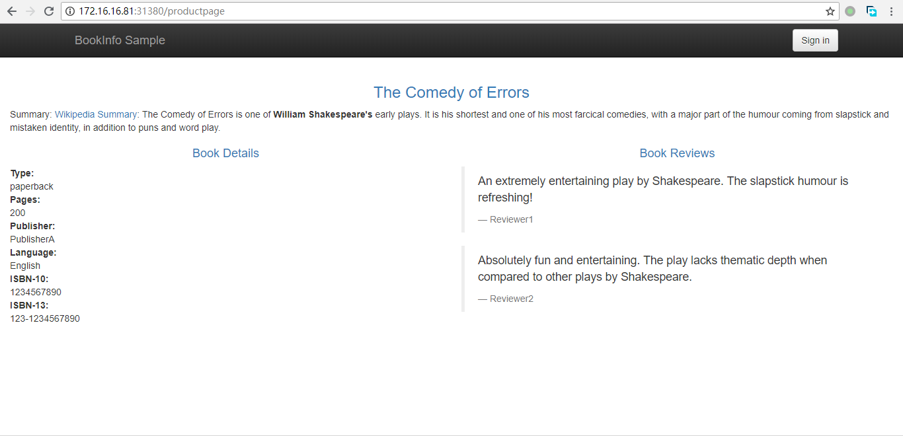

# Istio部署安装

## 参考链接

[快速指南](https://preliminary.istio.io/zh/docs/setup/kubernetes/quick-start/)

## 下载istio

```bash
[root@vm01 ~]# wget https://github.com/istio/istio/releases/download/1.0.0/istio-1.0.0-linux.tar.gz
[root@vm01 ~]# tar xvf istio-1.0.0-linux.tar.gz
[root@vm01 ~]# cd istio-1.0.0/
[root@vm01 istio-1.0.0]# cp bin/istioctl /usr/bin/
[root@vm01 istio-1.0.0]# chown root:root /usr/bin/istioctl
[root@vm01 istio-1.0.0]# vi install/kubernetes/istio-demo.yaml
kind: Service
metadata:
  name: istio-ingressgateway
  namespace: istio-system
  annotations:
  labels:
    chart: gateways-1.0.0
    release: RELEASE-NAME
    heritage: Tiller
    app: istio-ingressgateway
    istio: ingressgateway
spec:
  type: NodePort
  selector:
    app: istio-ingressgateway
    istio: ingressgateway
```

* 由于没有loadbalancer，把type改为NodePort，避免创建服务时处于pending状态；

## 安装Istio

```bash
[root@vm01 istio-1.0.0]# kubectl apply -f install/kubernetes/istio-demo.yaml
namespace "istio-system" created
configmap "istio-galley-configuration" created
configmap "istio-grafana-custom-resources" created
configmap "istio-statsd-prom-bridge" created
configmap "prometheus" created
configmap "istio-security-custom-resources" created
configmap "istio" created
configmap "istio-sidecar-injector" created
serviceaccount "istio-galley-service-account" created
serviceaccount "istio-egressgateway-service-account" created
serviceaccount "istio-ingressgateway-service-account" created
serviceaccount "istio-grafana-post-install-account" created
clusterrole.rbac.authorization.k8s.io "istio-grafana-post-install-istio-system" created
clusterrolebinding.rbac.authorization.k8s.io "istio-grafana-post-install-role-binding-istio-system" created
job.batch "istio-grafana-post-install" created
serviceaccount "istio-mixer-service-account" created
serviceaccount "istio-pilot-service-account" created
serviceaccount "prometheus" created
serviceaccount "istio-cleanup-secrets-service-account" created
clusterrole.rbac.authorization.k8s.io "istio-cleanup-secrets-istio-system" created
clusterrolebinding.rbac.authorization.k8s.io "istio-cleanup-secrets-istio-system" created
job.batch "istio-cleanup-secrets" created
serviceaccount "istio-citadel-service-account" created
serviceaccount "istio-sidecar-injector-service-account" created
customresourcedefinition.apiextensions.k8s.io "virtualservices.networking.istio.io" created
customresourcedefinition.apiextensions.k8s.io "destinationrules.networking.istio.io" created
customresourcedefinition.apiextensions.k8s.io "serviceentries.networking.istio.io" created
customresourcedefinition.apiextensions.k8s.io "gateways.networking.istio.io" created
customresourcedefinition.apiextensions.k8s.io "envoyfilters.networking.istio.io" created
customresourcedefinition.apiextensions.k8s.io "httpapispecbindings.config.istio.io" created
customresourcedefinition.apiextensions.k8s.io "httpapispecs.config.istio.io" created
customresourcedefinition.apiextensions.k8s.io "quotaspecbindings.config.istio.io" created
customresourcedefinition.apiextensions.k8s.io "quotaspecs.config.istio.io" created
customresourcedefinition.apiextensions.k8s.io "rules.config.istio.io" created
customresourcedefinition.apiextensions.k8s.io "attributemanifests.config.istio.io" created
customresourcedefinition.apiextensions.k8s.io "bypasses.config.istio.io" created
customresourcedefinition.apiextensions.k8s.io "circonuses.config.istio.io" created
customresourcedefinition.apiextensions.k8s.io "deniers.config.istio.io" created
customresourcedefinition.apiextensions.k8s.io "fluentds.config.istio.io" created
customresourcedefinition.apiextensions.k8s.io "kubernetesenvs.config.istio.io" created
customresourcedefinition.apiextensions.k8s.io "listcheckers.config.istio.io" created
customresourcedefinition.apiextensions.k8s.io "memquotas.config.istio.io" created
customresourcedefinition.apiextensions.k8s.io "noops.config.istio.io" created
customresourcedefinition.apiextensions.k8s.io "opas.config.istio.io" created
customresourcedefinition.apiextensions.k8s.io "prometheuses.config.istio.io" created
customresourcedefinition.apiextensions.k8s.io "rbacs.config.istio.io" created
customresourcedefinition.apiextensions.k8s.io "redisquotas.config.istio.io" created
customresourcedefinition.apiextensions.k8s.io "servicecontrols.config.istio.io" created
customresourcedefinition.apiextensions.k8s.io "signalfxs.config.istio.io" created
customresourcedefinition.apiextensions.k8s.io "solarwindses.config.istio.io" created
customresourcedefinition.apiextensions.k8s.io "stackdrivers.config.istio.io" created
customresourcedefinition.apiextensions.k8s.io "statsds.config.istio.io" created
customresourcedefinition.apiextensions.k8s.io "stdios.config.istio.io" created
customresourcedefinition.apiextensions.k8s.io "apikeys.config.istio.io" created
customresourcedefinition.apiextensions.k8s.io "authorizations.config.istio.io" created
customresourcedefinition.apiextensions.k8s.io "checknothings.config.istio.io" created
customresourcedefinition.apiextensions.k8s.io "kuberneteses.config.istio.io" created
customresourcedefinition.apiextensions.k8s.io "listentries.config.istio.io" created
customresourcedefinition.apiextensions.k8s.io "logentries.config.istio.io" created
customresourcedefinition.apiextensions.k8s.io "edges.config.istio.io" created
customresourcedefinition.apiextensions.k8s.io "metrics.config.istio.io" created
customresourcedefinition.apiextensions.k8s.io "quotas.config.istio.io" created
customresourcedefinition.apiextensions.k8s.io "reportnothings.config.istio.io" created
customresourcedefinition.apiextensions.k8s.io "servicecontrolreports.config.istio.io" created
customresourcedefinition.apiextensions.k8s.io "tracespans.config.istio.io" created
customresourcedefinition.apiextensions.k8s.io "rbacconfigs.rbac.istio.io" created
customresourcedefinition.apiextensions.k8s.io "serviceroles.rbac.istio.io" created
customresourcedefinition.apiextensions.k8s.io "servicerolebindings.rbac.istio.io" created
customresourcedefinition.apiextensions.k8s.io "adapters.config.istio.io" created
customresourcedefinition.apiextensions.k8s.io "instances.config.istio.io" created
customresourcedefinition.apiextensions.k8s.io "templates.config.istio.io" created
customresourcedefinition.apiextensions.k8s.io "handlers.config.istio.io" created
clusterrole.rbac.authorization.k8s.io "istio-galley-istio-system" created
clusterrole.rbac.authorization.k8s.io "istio-egressgateway-istio-system" created
clusterrole.rbac.authorization.k8s.io "istio-ingressgateway-istio-system" created
clusterrole.rbac.authorization.k8s.io "istio-mixer-istio-system" created
clusterrole.rbac.authorization.k8s.io "istio-pilot-istio-system" created
clusterrole.rbac.authorization.k8s.io "prometheus-istio-system" created
clusterrole.rbac.authorization.k8s.io "istio-citadel-istio-system" created
clusterrole.rbac.authorization.k8s.io "istio-sidecar-injector-istio-system" created
clusterrolebinding.rbac.authorization.k8s.io "istio-galley-admin-role-binding-istio-system" created
clusterrolebinding.rbac.authorization.k8s.io "istio-egressgateway-istio-system" created
clusterrolebinding.rbac.authorization.k8s.io "istio-ingressgateway-istio-system" created
clusterrolebinding.rbac.authorization.k8s.io "istio-mixer-admin-role-binding-istio-system" created
clusterrolebinding.rbac.authorization.k8s.io "istio-pilot-istio-system" created
clusterrolebinding.rbac.authorization.k8s.io "prometheus-istio-system" created
clusterrolebinding.rbac.authorization.k8s.io "istio-citadel-istio-system" created
clusterrolebinding.rbac.authorization.k8s.io "istio-sidecar-injector-admin-role-binding-istio-system" created
service "istio-galley" created
service "istio-egressgateway" created
service "istio-ingressgateway" created
service "grafana" created
service "istio-policy" created
service "istio-telemetry" created
service "istio-statsd-prom-bridge" created
deployment.extensions "istio-statsd-prom-bridge" created
service "istio-pilot" created
service "prometheus" created
service "istio-citadel" created
service "servicegraph" created
service "istio-sidecar-injector" created
deployment.extensions "istio-galley" created
deployment.extensions "istio-egressgateway" created
deployment.extensions "istio-ingressgateway" created
deployment.extensions "grafana" created
deployment.extensions "istio-policy" created
deployment.extensions "istio-telemetry" created
deployment.extensions "istio-pilot" created
deployment.extensions "prometheus" created
deployment.extensions "istio-citadel" created
deployment.extensions "servicegraph" created
deployment.extensions "istio-sidecar-injector" created
deployment.extensions "istio-tracing" created
gateway.networking.istio.io "istio-autogenerated-k8s-ingress" created
horizontalpodautoscaler.autoscaling "istio-egressgateway" created
horizontalpodautoscaler.autoscaling "istio-ingressgateway" created
horizontalpodautoscaler.autoscaling "istio-policy" created
horizontalpodautoscaler.autoscaling "istio-telemetry" created
horizontalpodautoscaler.autoscaling "istio-pilot" created
service "jaeger-query" created
service "jaeger-collector" created
service "jaeger-agent" created
service "zipkin" created
service "tracing" created
mutatingwebhookconfiguration.admissionregistration.k8s.io "istio-sidecar-injector" created
attributemanifest.config.istio.io "istioproxy" created
attributemanifest.config.istio.io "kubernetes" created
stdio.config.istio.io "handler" created
logentry.config.istio.io "accesslog" created
logentry.config.istio.io "tcpaccesslog" created
rule.config.istio.io "stdio" created
rule.config.istio.io "stdiotcp" created
metric.config.istio.io "requestcount" created
metric.config.istio.io "requestduration" created
metric.config.istio.io "requestsize" created
metric.config.istio.io "responsesize" created
metric.config.istio.io "tcpbytesent" created
metric.config.istio.io "tcpbytereceived" created
prometheus.config.istio.io "handler" created
rule.config.istio.io "promhttp" created
rule.config.istio.io "promtcp" created
kubernetesenv.config.istio.io "handler" created
rule.config.istio.io "kubeattrgenrulerule" created
rule.config.istio.io "tcpkubeattrgenrulerule" created
kubernetes.config.istio.io "attributes" created
destinationrule.networking.istio.io "istio-policy" created
destinationrule.networking.istio.io "istio-telemetry" created

[root@vm01 ~]# kubectl get svc -n istio-system
NAME                       TYPE        CLUSTER-IP       EXTERNAL-IP   PORT(S)                                                                                                     AGE
grafana                    ClusterIP   10.254.2.51      <none>        3000/TCP                                                                                                    1h
istio-citadel              ClusterIP   10.254.232.158   <none>        8060/TCP,9093/TCP                                                                                           1h
istio-egressgateway        ClusterIP   10.254.172.106   <none>        80/TCP,443/TCP                                                                                              1h
istio-galley               ClusterIP   10.254.6.143     <none>        443/TCP,9093/TCP                                                                                            1h
istio-ingressgateway       NodePort    10.254.185.228   <none>        80:31380/TCP,443:31390/TCP,31400:31400/TCP,15011:31322/TCP,8060:30638/TCP,15030:31522/TCP,15031:32345/TCP   1h
istio-pilot                ClusterIP   10.254.193.84    <none>        15010/TCP,15011/TCP,8080/TCP,9093/TCP                                                                       1h
istio-policy               ClusterIP   10.254.43.23     <none>        9091/TCP,15004/TCP,9093/TCP                                                                                 1h
istio-sidecar-injector     ClusterIP   10.254.216.151   <none>        443/TCP                                                                                                     1h
istio-statsd-prom-bridge   ClusterIP   10.254.171.166   <none>        9102/TCP,9125/UDP                                                                                           1h
istio-telemetry            ClusterIP   10.254.48.175    <none>        9091/TCP,15004/TCP,9093/TCP,42422/TCP                                                                       1h
jaeger-agent               ClusterIP   None             <none>        5775/UDP,6831/UDP,6832/UDP                                                                                  1h
jaeger-collector           ClusterIP   10.254.135.200   <none>        14267/TCP,14268/TCP                                                                                         1h
jaeger-query               ClusterIP   10.254.153.55    <none>        16686/TCP                                                                                                   1h
prometheus                 ClusterIP   10.254.150.192   <none>        9090/TCP                                                                                                    1h
servicegraph               ClusterIP   10.254.188.145   <none>        8088/TCP                                                                                                    1h
tracing                    ClusterIP   10.254.129.32    <none>        80/TCP                                                                                                      1h
zipkin                     ClusterIP   10.254.17.59     <none>        9411/TCP                                                                                                    1h
[root@vm01 ~]# kubectl get pod -n istio-system
NAME                                        READY     STATUS      RESTARTS   AGE
grafana-66469c4d95-v6qvk                    1/1       Running     0          3h
istio-citadel-5799b76c66-gbwhw              1/1       Running     0          3h
istio-cleanup-secrets-r85b9                 0/1       Completed   0          3h
istio-egressgateway-6578f84b68-hpb9p        1/1       Running     0          1h
istio-egressgateway-6578f84b68-mkrdf        1/1       Running     0          1h
istio-egressgateway-6578f84b68-qn6q9        1/1       Running     0          1h
istio-egressgateway-6578f84b68-tv9x8        1/1       Running     0          3h
istio-egressgateway-6578f84b68-v46b5        1/1       Running     0          1h
istio-galley-5bf4d6b8f7-kql8h               1/1       Running     0          3h
istio-ingressgateway-67995c486c-4gc4w       1/1       Running     0          44m
istio-ingressgateway-67995c486c-8v74j       1/1       Running     0          48m
istio-ingressgateway-67995c486c-9s5xh       1/1       Running     0          3h
istio-ingressgateway-67995c486c-qxmhk       1/1       Running     0          40m
istio-ingressgateway-67995c486c-s4f6g       1/1       Running     0          40m
istio-pilot-5c778f6dfd-dv7hs                2/2       Running     0          3h
istio-policy-8667975f76-hrtkh               2/2       Running     0          3h
istio-sidecar-injector-5b5fcf4df6-l5c48     1/1       Running     0          3h
istio-statsd-prom-bridge-7f44bb5ddb-4df6p   1/1       Running     0          3h
istio-telemetry-7d87746bbf-dlnfd            2/2       Running     0          3h
istio-telemetry-7d87746bbf-j7s59            2/2       Running     0          46m
istio-telemetry-7d87746bbf-lmxrn            2/2       Running     0          8m
istio-telemetry-7d87746bbf-xqz82            2/2       Running     0          41m
istio-tracing-ff94688bb-dslhj               1/1       Running     0          3h
prometheus-84bd4b9796-kl99n                 1/1       Running     0          3h
servicegraph-7875b75b4f-655kh               1/1       Running     0          3h
```

* 安装istio难点还是GCR上下载镜像，镜像可从我的分享里下载[Istio 1.0镜像](https://pan.baidu.com/s/1ZxVFnkvmJbGDJMdkW4FEoQ)；

## 创建ingress访问grafana

```bash
[root@vm01 ~]# htpasswd -c ./auth admin
New password:
Re-type new password:
Adding password for user admin
[root@vm01 new]# kubectl create secret generic traefik-admin --from-file auth --namespace=istio-system
secret "traefik-admin" created
[root@vm01 ~]# vi istio-ingress.yaml
apiVersion: extensions/v1beta1
kind: Ingress
metadata:
  name: istio-ingress
  namespace: istio-system
  annotations:
    kubernetes.io/ingress.class: traefik
    ingress.kubernetes.io/auth-type: "basic"
    ingress.kubernetes.io/auth-secret: "traefik-admin"
spec:
  rules:
- host: istio-grafana.k8s.local
  http:
    paths:
  - path: /
    backend:
      serviceName: grafana
      servicePort: 3000
    [root@vm01 ~]# kubectl create -f istio-ingress.yaml
    ingress.extensions "istio-ingress" created
```

* 客户端浏览器增加hosts映射域名和主机，访问`istio-grafana.k8s.local`访问grafana；

## 安装应用示例

```bash
[root@vm01 istio-1.0.0]# kubectl apply -f <(istioctl kube-inject -f samples/bookinfo/platform/kube/bookinfo.yaml)
service "details" created
deployment.extensions "details-v1" created
service "ratings" created
deployment.extensions "ratings-v1" created
service "reviews" created
deployment.extensions "reviews-v1" created
deployment.extensions "reviews-v2" created
deployment.extensions "reviews-v3" created
service "productpage" created
deployment.extensions "productpage-v1" created
[root@vm01 istio-1.0.0]# kubectl get services
NAME                       TYPE        CLUSTER-IP       EXTERNAL-IP   PORT(S)    AGE
details                    ClusterIP   10.254.35.178    <none>        9080/TCP   32s
kubernetes                 ClusterIP   10.254.0.1       <none>        443/TCP    47d
productpage                ClusterIP   10.254.241.170   <none>        9080/TCP   31s
ratings                    ClusterIP   10.254.84.68     <none>        9080/TCP   32s
reviews                    ClusterIP   10.254.218.116   <none>        9080/TCP   32s
[root@vm01 new]# kubectl get pods -o wide
NAME                             READY     STATUS    RESTARTS   AGE       IP             NODE
details-v1-7c4d47c7d6-flrvv      2/2       Running   0          23m       10.253.98.15   vm01
productpage-v1-59fdfbb54-qk5q4   2/2       Running   0          23m       10.253.71.15   vm02
ratings-v1-7ffddf66cd-6wj9x      2/2       Running   0          23m       10.253.71.13   vm02
reviews-v1-5bfd56598d-wffdb      2/2       Running   0          23m       10.253.78.14   vm03
reviews-v2-68d4b86696-l8mtv      2/2       Running   0          23m       10.253.71.14   vm02
reviews-v3-56d66dddd8-jwm8b      2/2       Running   0          23m       10.253.48.11   vm04
[root@vm01 istio-1.0.0]# kubectl apply -f samples/bookinfo/networking/bookinfo-gateway.yaml
gateway.networking.istio.io "bookinfo-gateway" created
virtualservice.networking.istio.io "bookinfo" created
```

## 访问应用示例

```bash
[root@vm01 ~]# export INGRESS_PORT=$(kubectl -n istio-system get service istio-ingressgateway -o jsonpath='{.spec.ports[?(@.name=="http2")].nodePort}')
[root@vm01 ~]# export INGRESS_HOST=$(kubectl get po -l istio=ingressgateway -n istio-system -o 'jsonpath={.items[0].status.hostIP}')
[root@vm01 ~]# export GATEWAY_URL=$INGRESS_HOST:$INGRESS_PORT
[root@vm01 ~]# echo $INGRESS_HOST
172.16.16.81
[root@vm01 ~]# echo $INGRESS_PORT
31380
[root@vm01 ~]# echo $GATEWAY_URL
172.16.16.81:31380
[root@vm01 ~]# curl -o /dev/null -s -w "%{http_code}\n" http://${GATEWAY_URL}/productpage
200
```

* 获取`$GATEWAY_URL`,通过浏览器访问，并刷新页面，可以看到 `reviews` 服务的不同版本的效果（红色、黑色的星形或者没有显示） ；




查看Grafana的Istio Mesh Dashboard面板，可以看到各服务的运行响应状态。

