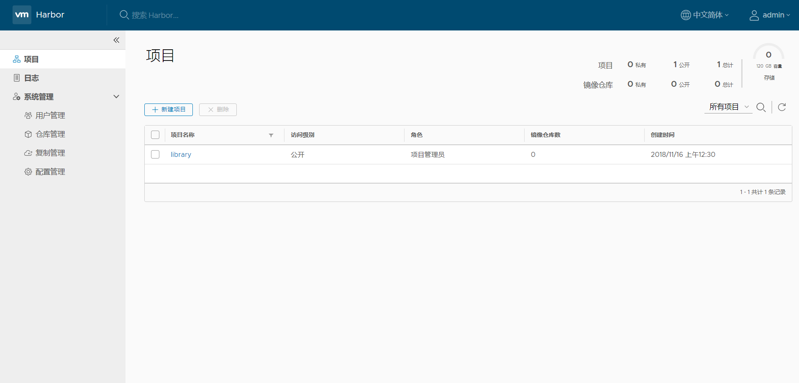

# Harbor部署

Harbor是VMware开源的一款企业级容器镜像仓库，本文介绍如何在CentOS-7.5上安装Harbor。

## 配置防火墙

```bash
[root@harbor ~]# firewall-cmd --zone=public --add-service=http --permanent
[root@harbor ~]# firewall-cmd --zone=public --add-service=https  --permanent
[root@harbor ~]# firewall-cmd --reload
```

* Harbor使用80端口对外提供UI访问，因此需要开通防火墙规则，允许http访问；

## 安装Docker-ce

harbor安装依赖docker和docker-compose。高版本的docker-ce包含很多新特性，建议部署docker-ce版本替代CentOS源中的docker；

```bash
[root@harbor ~]# yum remove docker \
  docker-client \
 docker-client-latest \
 docker-common \
 docker-latest \
 docker-latest-logrotate \
 docker-logrotate \
 docker-selinux \
 docker-engine-selinux \
 docker-engine
```

* 安装docker-ce前需要卸载CentOS 7.5源中的docker相关软件；

```bash
[root@harbor ~]# yum install -y yum-utils device-mapper-persistent-data lvm2
[root@harbor ~]# yum-config-manager --add-repo http://mirrors.aliyun.com/docker-ce/linux/centos/docker-ce.repo
[root@harbor ~]# yum install docker-ce
[root@harbor ~]# vi /etc/docker/daemon.json
{
  "insecure-registries" : ["172.16.16.249"]
}
[root@harbor ~]# systemctl enable docker && systemctl start docker
```

* 通过Docker官方源安装docker-ce；

```bash
[root@harbor ~]# curl -L "https://github.com/docker/compose/releases/download/1.23.1/docker-compose-$(uname -s)-$(uname -m)" -o /usr/bin/docker-compose
[root@harbor ~]# chmod a+x /usr/bin/docker-compose
```

* 安装docker-compose。

## 安装Harbor

```bash
[root@harbor ~]# yum -y install epel-release
[root@harbor ~]# yum install python-pip
```

* 安装python-pip；

```bash
[root@harbor ~]# wget https://storage.googleapis.com/harbor-releases/harbor-offline-installer-v1.5.4.tgz
[root@harbor ~]# tar xvf harbor-offline-installer-v1.5.4.tgz
```

* 可从[Harbor offline installer](https://github.com/goharbor/harbor/releases)找到安装包；

```bash
[root@harbor ~]# cd harbor/
[root@harbor harbor]# vi harbor.cfg
hostname = 172.16.16.89
harbor_admin_password = xxxx
self_registration = off
db_password = xxxx
```

* 修改配置文件，设置harbor的监听地址，管理员admin账户密码，是否允许用户自行注册(这里设置为只允许管理员创建账户)，Harbor MySQL数据库的密码；

```bash
[root@harbor harbor]# ./install.sh
```

* 执行`./install.sh`安装Harbor；
* 安装完成后通过[http://172.16.16.89](http://172.16.16.89)访问Harbor WEB UI；

