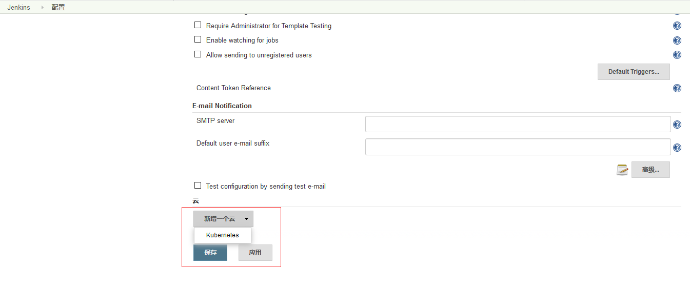
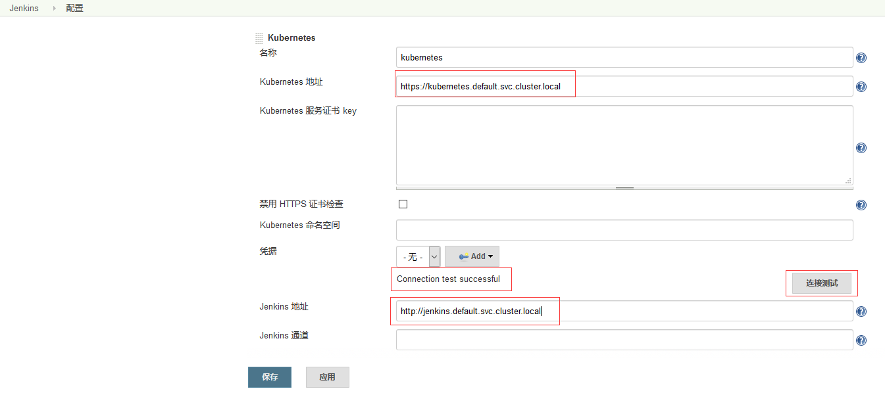
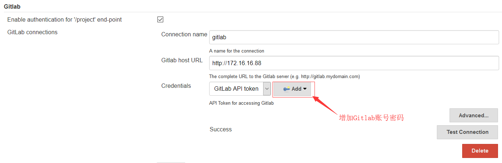
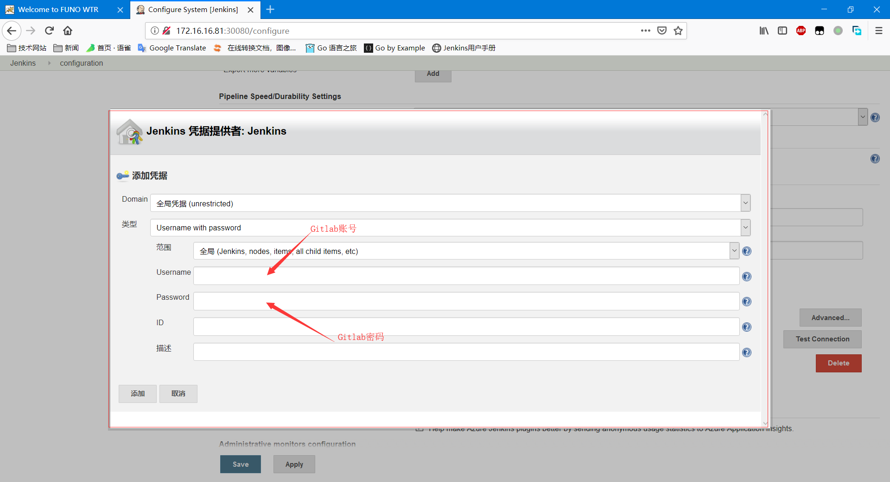
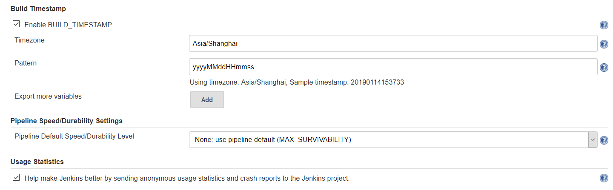
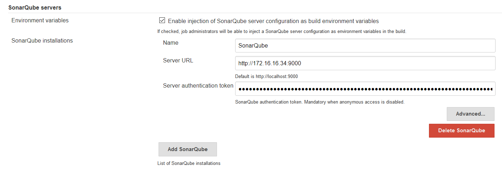
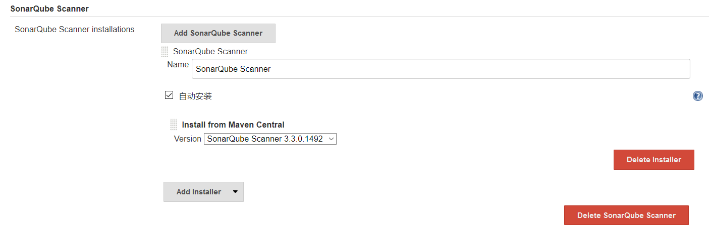

# Kubernetes&Jenkins CI/CD Pipeline

## 环境说明

kubernetes apiserver：172.16.16.81
gitlab: 172.16.16.88
sonorqube: 172.16.16.34:9000
jenkins: 172.16.16.81:30080
harbor: 172.16.16.249
nexus3: 172.16.16.192

## 插件参考资料

* [Build Timestamp Plugin](https://wiki.jenkins.io/display/JENKINS/GitLab+Plugin)
* [GitLab Plugin](https://wiki.jenkins.io/display/JENKINS/GitLab+Plugin)
* [Kubernetes plugin](https://github.com/jenkinsci/kubernetes-plugin)
* [Kubernetes Continuous Deploy Plugin](https://wiki.jenkins.io/display/JENKINS/Kubernetes+Continuous+Deploy+Plugin)
* [SonarQube Scanner for Jenkins](https://docs.sonarqube.org/display/SCAN/Analyzing+with+SonarQube+Scanner+for+Jenkins)

## 部署jenkins

### 在k8s中部署jenkins

```bash
[user@k8s01 ~]$ vi jenkins.yaml
apiVersion: apps/v1beta1
kind: StatefulSet
metadata:
  name: jenkins
  labels:
    name: jenkins
spec:
  serviceName: jenkins
  replicas: 1
  updateStrategy:
    type: RollingUpdate
  template:
    metadata:
      name: jenkins
      labels:
        name: jenkins
    spec:
      terminationGracePeriodSeconds: 10
      serviceAccountName: jenkins
      containers:
        - name: jenkins
          image: 172.16.16.249/library/jenkins/jenkins:lts-alpine
          imagePullPolicy: IfNotPresent
          ports:
            - containerPort: 8080
            - containerPort: 50000
          resources:
            limits:
              cpu: 4
              memory: 8Gi
            requests:
              cpu: 2
              memory: 4Gi
          env:
            - name: LIMITS_MEMORY
              valueFrom:
                resourceFieldRef:
                  resource: limits.memory
                  divisor: 1Mi
            - name: JAVA_OPTS
              # value: -XX:+UnlockExperimentalVMOptions -XX:+UseCGroupMemoryLimitForHeap -XX:MaxRAMFraction=1 -XshowSettings:vm -Dhudson.slaves.NodeProvisioner.initialDelay=0 -Dhudson.slaves.NodeProvisioner.MARGIN=50 -Dhudson.slaves.NodeProvisioner.MARGIN0=0.85
              value: -Xmx$(LIMITS_MEMORY)m -XshowSettings:vm -Dhudson.slaves.NodeProvisioner.initialDelay=0 -Dhudson.slaves.NodeProvisioner.MARGIN=50 -Dhudson.slaves.NodeProvisioner.MARGIN0=0.85
          volumeMounts:
            - name: jenkins-home
              mountPath: /var/jenkins_home
          livenessProbe:
            httpGet:
              path: /login
              port: 8080
            initialDelaySeconds: 120
            timeoutSeconds: 5
            failureThreshold: 12 # ~2 minutes
          readinessProbe:
            httpGet:
              path: /login
              port: 8080
            initialDelaySeconds: 120
            timeoutSeconds: 5
            failureThreshold: 12 # ~2 minutes
      securityContext:
        fsGroup: 1000
  volumeClaimTemplates:
  - metadata:
      name: jenkins-home
      # annotations:
      #   volume.beta.kubernetes.io/storage-class: anything
    spec:
      accessModes: [ "ReadWriteOnce" ]
      resources:
        requests:
          storage: 50Gi

---
apiVersion: v1
kind: Service
metadata:
  name: jenkins
  annotations:
    # ensure the client ip is propagated to avoid the invalid crumb issue (k8s <1.7)
    # service.beta.kubernetes.io/external-traffic: OnlyLocal
spec:
  type: NodePort
  selector:
    name: jenkins
  # k8s 1.7+
  ports:
    -
      name: http
      port: 80
      nodePort: 30080
      targetPort: 8080
      protocol: TCP
    -
      name: agent
      port: 50000
      nodePort: 30081
      protocol: TCP
```

```bash
[user@k8s01 ~]$ vi service-account.yml
apiVersion: v1
kind: ServiceAccount
metadata:
  name: jenkins
---
kind: Role
apiVersion: rbac.authorization.k8s.io/v1beta1
metadata:
  name: jenkins
rules:
- apiGroups: [""]
  resources: ["pods"]
  verbs: ["create","delete","get","list","patch","update","watch"]
- apiGroups: [""]
  resources: ["pods/exec"]
  verbs: ["create","delete","get","list","patch","update","watch"]
- apiGroups: [""]
  resources: ["pods/log"]
  verbs: ["get","list","watch"]
- apiGroups: [""]
  resources: ["secrets"]
  verbs: ["get"]
---
apiVersion: rbac.authorization.k8s.io/v1beta1
kind: RoleBinding
metadata:
  name: jenkins
roleRef:
  apiGroup: rbac.authorization.k8s.io
  kind: Role
  name: jenkins
subjects:
- kind: ServiceAccount
  name: jenkins
```

```bash
[user@k8s01 ~]$ kubectl create namespace jenkins
[user@k8s01 ~]$ kubectl create -f service-account.yml -n jenkins
[user@k8s01 ~]$ kubectl create -f jenkins.yml -n jenkins
```

获取jenkins密码，用于首次登陆jenkins。

```bash
[user@k8s01 ~]$ kubectl logs -n jenkins jenkins-0 -f
ee566d6e189a4210aca4b427b424f84a
```

## 访问jenkins

访问[http://172.16.16.81:30080](http://172.16.16.81:30080)通过以上命令获取的密码登陆jenkins，账号为admin，登陆后修改默认密码。

## 安装配置插件

登陆后会提示插件安装，选择以下插件：

* Build Timestamp Plugin
* GitLab Plugin
* Kubernetes plugin
* Kubernetes Continuous Deploy Plugin
* SonarQube Scanner for Jenkins

### 配置kubernetes plugin

打开面板"系统管理"->"系统设置"->"增加一个云"，按如下进行配置：




### 配置gitlab plugin

打开面板"系统管理"->"系统设置"，按如下进行配置：




### Build Timestamp Plugin配置



## SonarQube Scanner for Jenkin配置

打开面板"系统管理"->"全局设置"，按下图进行设置sonarqube server，token需要在sonarqube的用户安全里生成。



打开面板"系统管理"->"全局工具配置"，按如下设置sonarqube scanner：



## 代码仓库配置

### Dockerfile

```dockerfile
FROM 172.16.16.249/library/maven/maven:3.6.0-jdk-8-alpine AS builder
MAINTAINER linxufang@funo.com.cn

WORKDIR /app
ADD . /app
RUN mvn install

FROM 172.16.16.249/library/openjdk/openjdk:8-jre-alpine
RUN apk --no-cache add ca-certificates && rm -rf /var/cache/apk/*
WORKDIR /app
COPY --from=builder /app/target/devopsdemo-0.9.jar devopsdemo-0.9-docker.jar
ENTRYPOINT ["java","-jar","devopsdemo-0.9-docker.jar"]
EXPOSE 8001
```

* Dockerfile存放在gitlab代码仓库根目录下。

### Deployment Yaml

```yaml
apiVersion: extensions/v1beta1
kind: Deployment
metadata:
  name: java-demo
spec:
  replicas: 1
  template:
    metadata:
      labels:
        app: java-demo
    spec:
      containers:
      - name: java-demo
        image: 172.16.16.249/library/java-demo:$BUILD_TIMESTAMP
        ports:
        - containerPort: 8001
      imagePullSecrets:
      - name: $KUBERNETES_SECRET_NAME
---
kind: Service
apiVersion: v1
metadata:
  name: java-demo
spec:
  selector:
    app: java-demo
  type: NodePort
  ports:
    - port: 8001
      targetPort: 8001
      nodePort: 32000
```

* Deployment配置文件java-demo.yaml存放在gitlab代码仓库根目录下。

### Sonorqube代码检查

```bash
sonar.projectKey=sonor-java-demo
sonar.projectName=java-demo
sonar.projectVersion=1.0
sonar.sources=src
sonar.language=java
sonar.sourceEncoding=UTF-8
```

`sonar-project.properties`是sonarqube scanner的配置文件，存放在gitlab代码仓库根目录下。

## 创建运行pipeline

创建个pod模板，运行两个容器：docker和jnlp。其中jnlp容器用于执行pipeline。docker容器调用节点上的docker daemon，执行pipeline中的docker build、tag、build等工作。pipeline的内容大致如下，pipeline中涉及的验证信息需要在`Pipeline Syntax`中生成，具体参考各插件的说明文档。

```text
podTemplate(label: 'jenkins-slave',containers: [
    containerTemplate(name: 'docker', image: '172.16.16.249/library/docker/docker:stable', ttyEnabled: true, command: 'cat'),
    containerTemplate(name: 'jnlp', image: '172.16.16.249/library/jenkins/jnlp-slave:latest', args: '${computer.jnlpmac} ${computer.name}')
],volumes: [
    hostPathVolume(mountPath: '/var/run/docker.sock', hostPath: '/var/run/docker.sock'),
])
{
    node('jenkins-slave') {
        stage("SCM Checkout"){
            git credentialsId: 'gitlab-dev', url: 'http://172.16.16.88/dev/java-demo.git'
        }
        stage('SonarQube analysis') {
            // requires SonarQube Scanner 2.8+
            def scannerHome = tool 'SonarQube Scanner';
            withSonarQubeEnv('SonarQube') {
                sh "${scannerHome}/bin/sonar-scanner"
            }
        }
        stage("Docker Build"){
            container('docker') {
                sh "docker build -t 172.16.16.249/library/java-demo:$BUILD_TIMESTAMP ."
                sh "docker tag 172.16.16.249/library/java-demo:$BUILD_TIMESTAMP 172.16.16.249/library/java-demo:latest"
            }
        }
        stage("Push Images"){
            container('docker') {
                withDockerRegistry(credentialsId: 'Harbor-Registry', url: 'http://172.16.16.249') {
                    sh "docker push 172.16.16.249/library/java-demo:$BUILD_TIMESTAMP"
                    sh "docker push 172.16.16.249/library/java-demo:latest"
                    sh '''docker rmi $(docker images -f 'dangling=true' -q)'''
                }
            }
        stage("Deploy to Kubernetes"){
            container('jnlp'){
                kubernetesDeploy configs: 'java-demo.yaml', dockerCredentials: [[credentialsId: 'Harbor-Registry', url: 'http://172.16.16.249']], kubeConfig: [path: ''], kubeconfigId: 'kubernetes-kubeconfig', secretName: '', ssh: [sshCredentialsId: '*', sshServer: ''], textCredentials: [certificateAuthorityData: '', clientCertificateData: '', clientKeyData: '', serverUrl: 'https://']
                }
            }
        }
    }
}
```